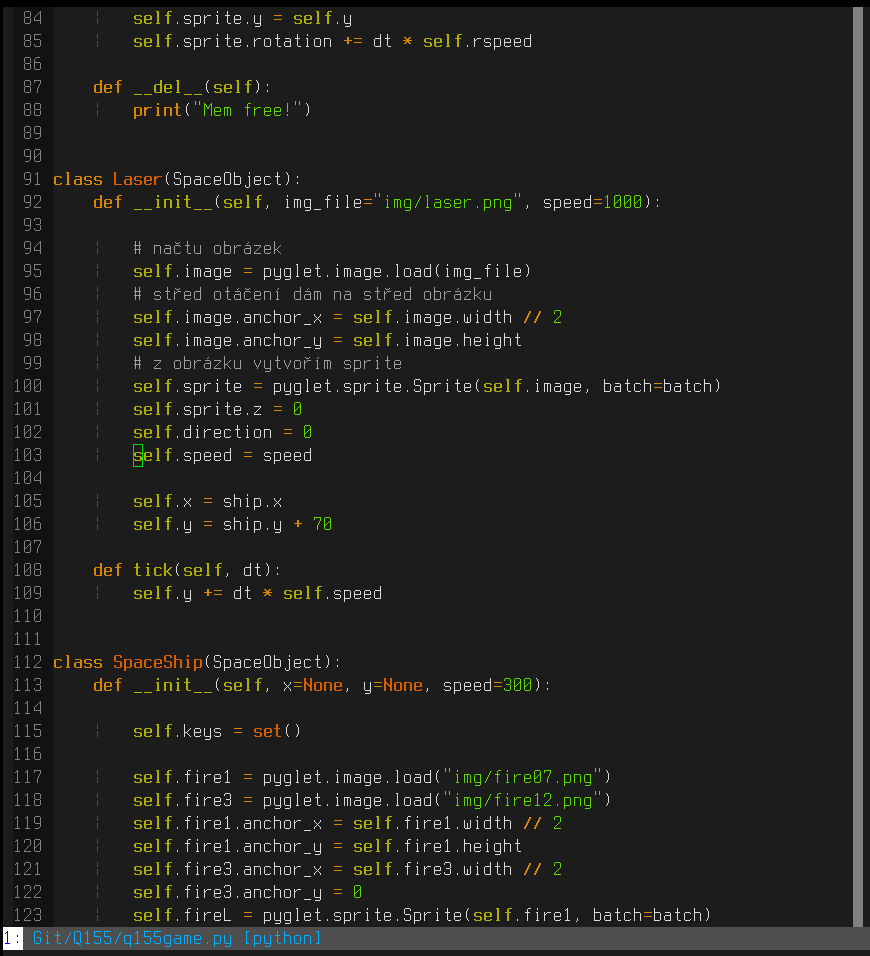
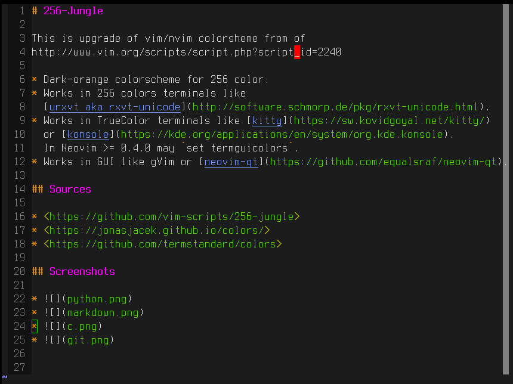
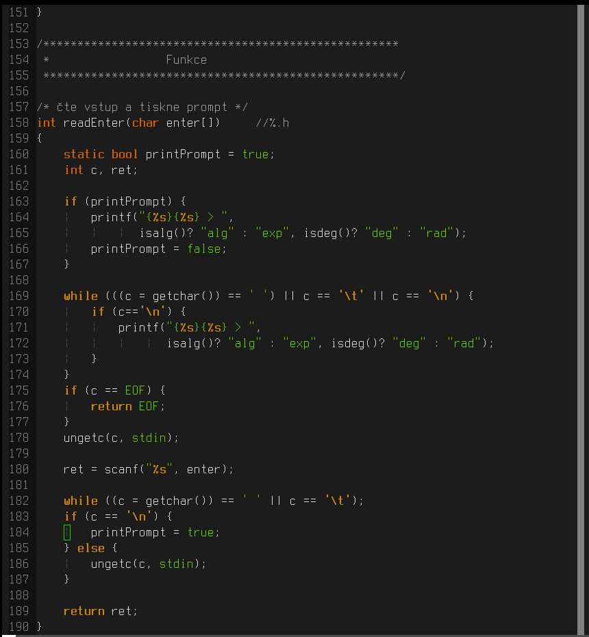
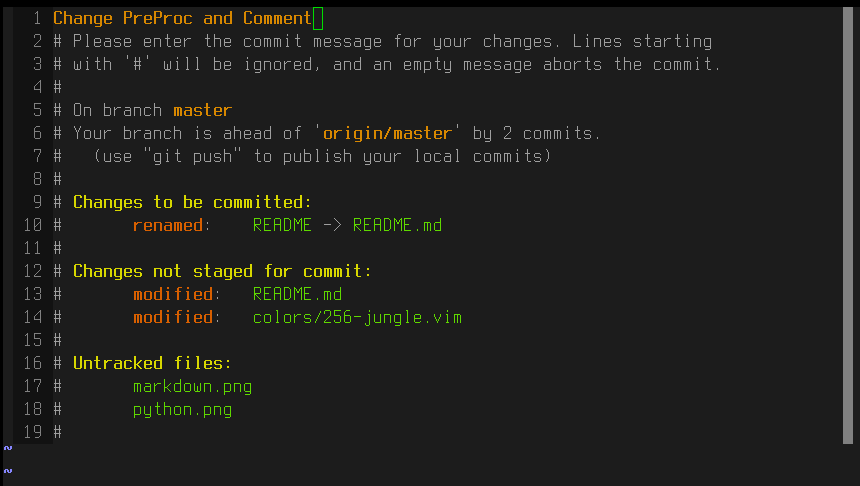

# 256-Jungle

This is upgrade of vim/nvim colorsheme from of 
http://www.vim.org/scripts/script.php?script_id=2240

* Dark-orange colorscheme for 256 color.
* Works in 256 colors terminals like 
  [urxvt aka rxvt-unicode](http://software.schmorp.de/pkg/rxvt-unicode.html).
* Works in TrueColor terminals like [kitty](https://sw.kovidgoyal.net/kitty/)
  or [konsole](https://kde.org/applications/en/system/org.kde.konsole).
  In Neovim >= 0.4.0 may `set termguicolors`.
* Works in GUI like gVim or [neovim-qt](https://github.com/equalsraf/neovim-qt).

## Sources

* <https://github.com/vim-scripts/256-jungle>
* <https://jonasjacek.github.io/colors/>
* <https://github.com/termstandard/colors>

## Screenshots

* Python 
* Markdown 
* C 
* Git 

